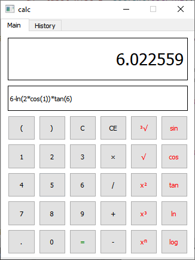
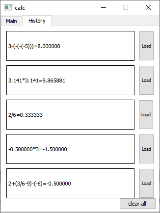

# GUI-calculator  

Created using C++ and Qt.  

  

### Screenshots
   

### Requirements  
* c++11 and Qt 5.15.2  

### Quick test  
download and extract zip from latest release and run calculator.exe  

### Installation  
1. Save project to your account by clicking on **FORK**  
2. download the project files  
3. install Qt along with Qt creator and mingw compiler
4. import project into Qt  

### Build  
1. from Qt creator deploy the project   
2. it will generate a build folder outside your project folder  
3. open it and click on release folder and copy calculator.exe to a new empty folder  
4. go to C:\Qt\5.15.2\mingw81_32\bin and run windeployqt from it  
5. change directory to folder with exe file  
6. type command "windeployqt calculator.exe" without quotation  
7. now you can run calculator.exe  

### Contribution  
Any contribution is welcomed  

